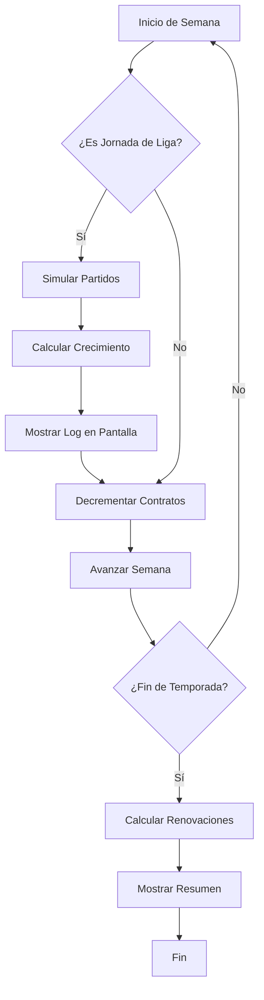

# 📋 Índice de Documentación - Sistema de Crecimiento y Renovación

## 🎯 Inicio Rápido

### Para Usuarios Nuevos:
1. Lee [`FINAL_IMPLEMENTATION_SUMMARY.md`](FINAL_IMPLEMENTATION_SUMMARY.md) - Resumen ejecutivo
2. Ejecuta `python personality_impact.py` - Ver funciones base
3. Ejecuta `python test_growth_system.py` - Test rápido (2 min)

### Para Desarrolladores:
1. Lee [`GROWTH_AND_RENEWAL_GUIDE.md`](GROWTH_AND_RENEWAL_GUIDE.md) - Guía técnica completa
2. Revisa [`personality_impact.py`](personality_impact.py) - Implementación de funciones
3. Revisa [`game.py`](game.py) - Integración en el game loop

---

## 📚 Documentación Principal

### Guías Completas
| Archivo | Descripción | Audiencia |
|---------|-------------|-----------|
| [`GROWTH_AND_RENEWAL_GUIDE.md`](GROWTH_AND_RENEWAL_GUIDE.md) | Guía técnica detallada del sistema completo | Desarrolladores |
| [`FINAL_IMPLEMENTATION_SUMMARY.md`](FINAL_IMPLEMENTATION_SUMMARY.md) | Resumen ejecutivo con validaciones | Todos |
| Este archivo | Índice de navegación | Todos |

### Documentación de Referencia
- [`data/personality_impacts.json`](data/personality_impacts.json) - Configuración de valores
- [`personality_impact.py`](personality_impact.py) - API y funciones (ver docstrings)

---

## 🧪 Scripts de Prueba

### Tests Automatizados
| Script | Duración | Propósito |
|--------|----------|-----------|
| [`personality_impact.py`](personality_impact.py) | < 1 seg | Demo de funciones base |
| [`test_growth_system.py`](test_growth_system.py) | ~2 min | Test de 15 semanas con rosters |
| [`test_full_season.py`](test_full_season.py) | ~5 min | Simulación de temporada completa (37 semanas) |
| [`visualize_evolution.py`](visualize_evolution.py) | ~5 min | Visualización detallada con tablas |

### Ejecutar Todos los Tests:
```bash
# Test rápido
python personality_impact.py

# Test intermedio
python test_growth_system.py

# Test completo
python test_full_season.py

# Visualización
python visualize_evolution.py
```

---

## 📂 Estructura del Código

### Archivos Principales

#### 1. **personality_impact.py**
Funciones de cálculo de impactos de personalidad.

**Funciones Nuevas:**
```python
skill_growth_chance(personality_name, category, 
                   rating_vs_team_avg, training_quality) -> float
# Retorna: probabilidad semanal de mejora (0.001 - 0.020)

renewal_intent_probability(personality_name, category,
                           cohesion_index, meets_objective,
                           performance_diff, player_morale) -> float
# Retorna: probabilidad de querer renovar (0.01 - 0.85)
```

**Funciones Existentes:**
```python
performance_multiplier()        # Efecto en rating
weekly_cohesion_delta()        # Cambio semanal de cohesión
weekly_conflict_probability()  # Prob. de evento de conflicto
team_morale_delta()           # Cambio de moral del equipo
player_morale_delta()         # Cambio de moral individual
```

#### 2. **game.py**
Loop principal del juego con integración de crecimiento.

**Métodos Nuevos:**
```python
_init_club_rosters()                # Crea 11 jugadores × 10 clubes
_process_weekly_player_growth()     # Procesa crecimiento cada semana
_process_season_end_renewals()      # Calcula renovaciones al final
_export_growth_summary()            # Genera resumen estadístico
```

**Estructuras de Datos Nuevas:**
```python
self.club_rosters = {club_name: [player_dict, ...]}
self.growth_log = [event_dict, ...]
self.renewal_log = [renewal_dict, ...]
```

#### 3. **data/personality_impacts.json**
Configuración centralizada de todos los valores.

**Secciones:**
- `levels`: Mapeo de niveles de desempeño
- `defaults`: Valores por categoría (Good, Best, etc.)
- `personalities`: Overrides específicos por personalidad
- `performance_alias`: Alias de niveles
- `caps`: Límites min/max para todos los valores
- **`development`**: Configuración de crecimiento semanal (NUEVO)
- **`renewal`**: Configuración de renovaciones (NUEVO)

---

## 🎮 Integración en el Juego

### Flujo Automático



### Puntos de Integración

1. **advance_week()** en game.py:
   - Llama a `_simulate_week_fixtures()`
   - Llama a `_process_weekly_player_growth()`
   - Muestra log de mejoras si ocurren

2. **Fin de temporada** (cuando week > total_weeks):
   - Llama a `_process_season_end_renewals()`
   - Genera y muestra resumen completo

---

## 📊 Valores de Referencia

### Probabilidades Típicas de Crecimiento

| Personalidad | Nivel | Prob. Base | Con Victoria | Con Derrota |
|--------------|-------|------------|--------------|-------------|
| Perfectionist | Best | 1.0% | 1.2% | 0.8% |
| Ambitious | Best | 1.0% | 1.2% | 0.8% |
| Leader | Good | 0.8% | 1.0% | 0.6% |
| Professional | Good | 0.8% | 1.0% | 0.6% |
| Team Player | Moderate | 0.6% | 0.8% | 0.4% |

### Probabilidades Típicas de Renovación

| Escenario | Prob. Típica | Descripción |
|-----------|--------------|-------------|
| Estrella feliz (Leader, obj. cumplidos, +10 perf) | 20-25% | Alta intención |
| Jugador neutro (Moderate, obj. no cumplidos, 0 perf) | 8-12% | Media intención |
| Insatisfecho (cualquiera, -10 perf, objetivos fallidos) | 1-5% | Baja intención |

### Frecuencias Esperadas

**En una temporada de 18 jornadas:**
- Eventos totales de crecimiento: 12-18
- Por club: 1-3 mejoras
- Por jugador: 0-2 mejoras (raro > 2)
- Mejora típica: +0.1 a +0.3 puntos

---

## 🔍 Debugging y Troubleshooting

### Ver Valores de Config:
```python
from personality_impact import _CONFIG
print(_CONFIG['development'])
print(_CONFIG['renewal'])
```

### Verificar Cálculo Manual:
```python
from personality_impact import skill_growth_chance, renewal_intent_probability

# Test crecimiento
prob = skill_growth_chance('Leader', 'Good', rating_vs_team_avg=5, training_quality=15)
print(f"Prob crecimiento: {prob:.4f}")  # Debe estar entre 0.001 y 0.020

# Test renovación
prob = renewal_intent_probability('Ambitious', 'Best', 
                                  cohesion_index=70, meets_objective=True,
                                  performance_diff=8, player_morale=65)
print(f"Prob renovación: {prob:.3f}")  # Debe estar entre 0.01 y 0.85
```

### Logs de Game:
Durante el juego, los logs se muestran automáticamente en pantalla.

Para acceder programáticamente:
```python
game = FootballAgentGame()
# ... inicializar y simular ...
print(f"Total eventos: {len(game.growth_log)}")
print(f"Últimos 5 eventos:")
for event in game.growth_log[-5:]:
    print(f"  {event['player']}: {event['old_rating']} → {event['new_rating']}")
```

---

## 🎓 Tutoriales

### Tutorial 1: Ejecutar Demo Básica
```bash
python personality_impact.py
```
**Verás:**
- Cohesión semanal de un XI mixto
- Performance multipliers por personalidad
- **Growth probability para Leader (nuevo)**
- **Renewal probability para Ambitious (nuevo)**

### Tutorial 2: Test Rápido con Rosters
```bash
python test_growth_system.py
```
**Verás:**
- Inicialización de 10 clubes con 11 jugadores cada uno
- Simulación de 15 semanas (10 pretemporada + 5 liga)
- Logs de crecimiento en pantalla
- Evaluación de renovaciones
- Resumen estadístico

### Tutorial 3: Temporada Completa
```bash
python test_full_season.py
```
**Verás:**
- Simulación de 37 semanas completas
- Tracking de 3 jugadores específicos
- Evolución completa
- Estadísticas por club y personalidad
- Renovaciones finales

### Tutorial 4: Visualización Detallada
```bash
python visualize_evolution.py
```
**Verás:**
- Tabla semanal con rating promedio
- Barras de progreso visuales
- Comparación inicio/fin
- Desglose por jugador
- Proyección de renovaciones con status

---

## 📖 Guías Relacionadas

### Del Proyecto Original:
- [`README.md`](README.md) - Descripción general del proyecto
- [`INTERFACE_GUIDE.py`](INTERFACE_GUIDE.py) - Demo de interfaces
- [`PERSONALITY_IMPACT_README.md`](PERSONALITY_IMPACT_README.md) - Guía de impacts originales

### Módulos Principales:
- [`player.py`](player.py) - Sistema de jugadores y personalidades
- [`club.py`](club.py) - Sistema de clubes con probabilidades
- [`agent.py`](agent.py) - Sistema del agente (tú)
- [`game_data.py`](game_data.py) - Datos de clubes y jugadores

---

## 💡 Tips y Best Practices

### Para Ajustar Valores:
1. Edita [`data/personality_impacts.json`](data/personality_impacts.json)
2. No hace falta recompilar
3. Ejecuta un test para validar: `python test_growth_system.py`

### Para Añadir Nuevas Personalidades:
1. Añade entrada en `personalities` del JSON
2. Especifica `performance_level`, `cohesion`, `conflict`
3. Opcionalmente añade base en `development` y `renewal`

### Para Debugging:
1. Añade prints en `_process_weekly_player_growth()` en game.py
2. Revisa `game.growth_log` y `game.renewal_log` en runtime
3. Usa los tests con diferentes seeds para reproducibilidad

---

## 🚀 Comandos Rápidos

```bash
# Ver funciones base
python personality_impact.py

# Test rápido (2 min)
python test_growth_system.py

# Test completo (5 min)
python test_full_season.py

# Visualización (5 min)
python visualize_evolution.py

# Juego completo
python main.py
```

---

## 📞 Contacto y Ayuda

### ¿Problemas?
1. Revisa [`GROWTH_AND_RENEWAL_GUIDE.md`](GROWTH_AND_RENEWAL_GUIDE.md) sección "Troubleshooting"
2. Ejecuta los tests para validar instalación
3. Verifica que [`data/personality_impacts.json`](data/personality_impacts.json) existe y es válido

### ¿Preguntas sobre Implementación?
- Lee docstrings en [`personality_impact.py`](personality_impact.py)
- Revisa código en [`game.py`](game.py) sección "PLAYER ROSTER & GROWTH TRACKING"
- Ejecuta tests con prints adicionales para entender flujo

---

**Última actualización:** 22 de diciembre de 2025  
**Versión:** 1.0  
**Estado:** ✅ Producción
